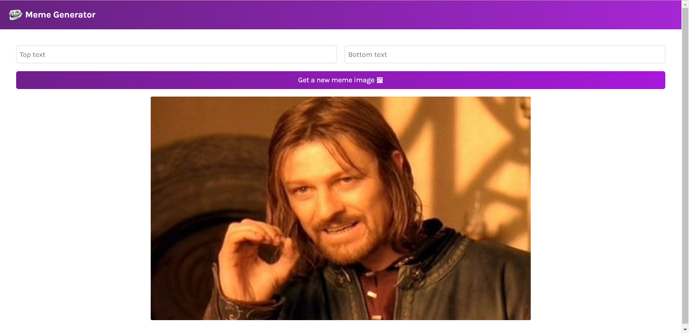

# Meme-Generator
This solution allows users to generate memes using hundreds of funny images, and by adding desired text on them. 

Deployed Link: https://meme-generator-01.netlify.app/

# Description
As the application loads It makes an immediate call to the imageflip API which returns an array of 100 most popular meme Images at that time. On clicking the "Get New Meme Image" button one of those 100 images is randomly returned. User can add the desired top and bottom text using the left and right textboxes.

# My Contribution and Learnings
This meme generator app is developed using Create-React-App environment. The entire JavaScript, HTML, and CSS code for this app is written by me.
While completing this project I got to learn about working with event listeners, conditional rendering, forms, and react hooks like useState, useEffect.

# Technology and Tools Used
Create-React-App environment, JavaScript, HTML, CSS, Figma, Netlify(Deployment)